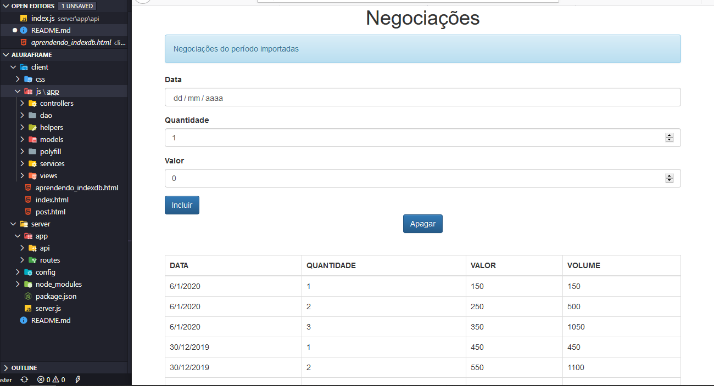

<h1 align="center">
<br>

<br>
<br>
Projeto de estudo - AluraFrame
</h1>

<br/>
Projeto desenvolvido durante os cursos da <a href=“https://www.alura.com.br/cursos-online-front-end/javascript“>Alura</a> de JavaScript Avançado ES6 (I, II, III).

Durante os cursos utilizamos diversos conceitos de programação: Padrão MVC, progamação defensiva, spread operator, arrow functions, template strings, templates dinâmicos, heranças, binding, API reflection, proxy, indexedDB, fetch API etc.

### Rodar Backend/API

> Você precisa ter o NodeJS instalado.
```
cd aluraframe/server

npm start
```
> Lembre-se de deixar rodando o backend...

- Para ver o site funcionando basta ir em aluraframe/client e abrir index.html 
